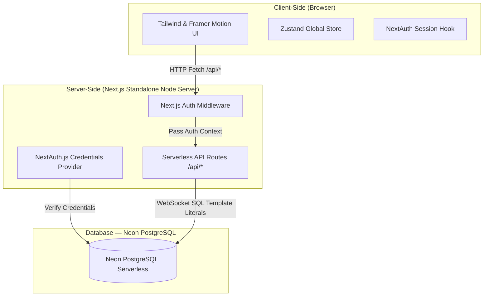
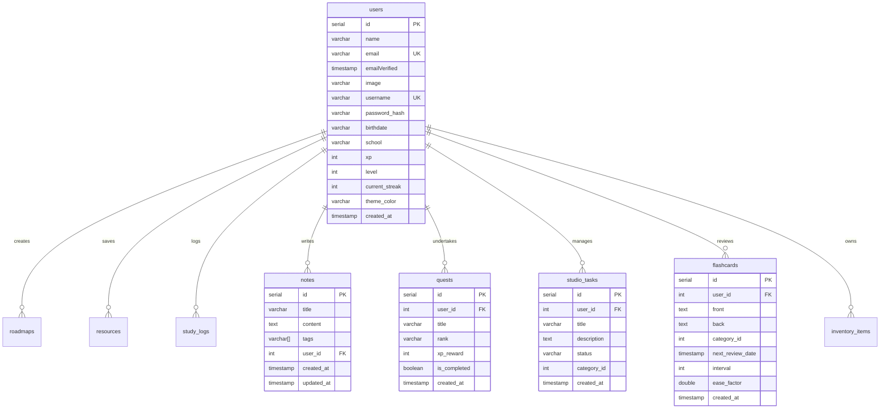

# Sinau.id — Product Specification

> **Version:** 3.0  
> **Last Updated:** May 29, 2026  
> **Status:** Fully Migrated to Standalone & Rebranded to Sinau.id (Premium Matte Dark SaaS)

---

## 1. Overview

**Sinau.id** is a premium, professional-grade self-directed learning management ecosystem (LMS) designed to help modern professionals, developers, and lifelong learners organize, track, and gamify their learning journey. It merges structured roadmap trackers, study logs, spaced repetition decks, Tavern RPG quests, creator pipeline Kanban boards, inventory management, and motivational virtual familiar companions into a single, cohesive dashboard using a sophisticated Matte Dark SaaS design system.

### Vision

> _"Empowering consistent, structured, and immersive self-directed education."_

### Target Users

| Persona                    | Description                                                 |
| -------------------------- | ----------------------------------------------------------- |
| **Self-taught Developers** | Learners following online courses, tutorials, and bootcamps |
| **Career Switchers**       | Professionals reskilling into tech with structured goals    |
| **Students & Scholars**    | Academic students supplementing formal education            |
| **Lifelong Learners**      | Anyone systematically mastering new skills or subjects      |

---

## 2. Tech Stack

| Layer                  | Technology                              | Version               |
| ---------------------- | --------------------------------------- | --------------------- |
| **Frontend Framework** | Next.js (App Router - Standalone Mode)  | 16.1.6                |
| **UI Library**         | React                                   | 19.2.3                |
| **Styling**            | Tailwind CSS                            | v4                    |
| **Animations**         | Framer Motion                           | 12.34.2               |
| **Icons**              | Lucide React                            | 0.575.0               |
| **Client State**       | Zustand (Persisted client-side store)  | v5                    |
| **Backend Framework**  | Next.js Serverless Route Handlers       | 16.1.6                |
| **Database Client**    | `@neondatabase/serverless` (Neon SQL)   | 1.1.0                 |
| **Database**           | Neon Serverless PostgreSQL              | —                     |
| **Auth**               | Auth.js v5 (NextAuth) + Bcrypt Hashing  | Credentials Flow      |

---

## 3. Architecture



### Design System (Matte Dark SaaS)

- **Theme:** Sophisticated Matte Dark Mode with high-contrast luminous accent tones.
- **Base Component:** `MatteCard` — solid dark surface (`bg-[#1C1C1E]`), faint luminous border (`border border-white/5`), subtle drop shadow (`shadow-md shadow-black/20`), elegant rounded corners (`rounded-2xl`).
- **Typography:** `Outfit` (for headers/uppercase actions) & `Inter` (for readable body and descriptions).
- **Layout:** Responsive layout with persistent Sidebar/Drawer on desktop/mobile and top utility navbar featuring Familiar Orb, Global Search, and Notification bell.
- **Animations:** Custom spring motion triggers, glowing orb breathing animations, and tactile micro-animations using Framer Motion.

---

## 4. Data Model



---

## 5. Features

### 5.1 Bento Grid Dashboard

The main interface utilizes a **Bento Grid Layout** built from premium `MatteCard` containers. The layout organizes core productivity components cleanly while preserving key interactive nodes.

| Widget          | Purpose                                                              |
| --------------- | -------------------------------------------------------------------- |
| **Streak**      | Tracks consecutive active days, current XP, and level up thresholds  |
| **Roadmap**     | Active learning path tracker with interactive step toggles           |
| **Timer**       | Pomodoro-style Focus Timer with live XP yields                      |
| **Daily Goals** | Tavern daily RPG quests and claims                                   |
| **Quick Notes** | Seamless markdown note-taking with local storage and catalog listing |
| **Familiar**    | Motivator familiar status card displaying active pet level and health|

---

### 5.2 Streak & Gamification

Tracks learning consistency and rewards progress with XP, level configurations, and rewards.

- **XP Engine:** Earn 10 XP per 1 minute of active Focus study time. Complete roadmap steps (+50 XP). Complete RPG Tavern quests to trigger instant XP allocation.
- **Level Configurations (`level_configs`):**
  - **1 - Novice:** 0 - 99 XP
  - **2 - Apprentice:** 100 - 299 XP
  - **3 - Scholar:** 300 - 599 XP
  - **4 - Adept:** 600 - 999 XP
  - **5 - Expert:** 1000 - 1499 XP
  - **6 - Master:** 1500 - 2099 XP
  - **7 - Grandmaster:** 2100 - 2799 XP
  - **8 - Legend:** 2800 - 3599 XP
  - **9 - Mythic:** 3600 - 4499 XP
  - **10 - Transcendent:** 4500+ XP

---

### 5.3 Learning Roadmaps

Structured curricula and course paths.

- Toggle roadmap step completion.
- Interactive percentage tracker indicating roadmap completion progress.
- Create, manage, and delete custom roadmaps with custom category tagging.

---

### 5.4 Focus Timer & Study Logs

Integrated Pomodoro utility.

- Focus timer configuration (e.g. 25-minute defaults) with real-time countdown.
- Complete sessions to automatically save details in Study Logs, add XP rewards, and feed the virtual familiar companion.

---

### 5.5 Tavern Quests & RPG System

RPG Quest Board with weighted random quest generators.

- Daily Quests dynamically generated with RNG ranks:
  - **Rank S:** 500 XP reward (5% spawn chance)
  - **Rank A:** 250 XP reward (10% spawn chance)
  - **Rank B:** 100 XP reward (40% spawn chance)
  - **Rank C:** 50 XP reward (45% spawn chance)
- Complete Tavern quests to claim bounties, trigger confetti effects, earn items, and automatically feed the virtual companion.

---

### 5.6 Creator Studio (Kanban Board)

A kanban-based creator pipeline built using drag-and-drop actions (`@dnd-kit`).

- Categories, descriptions, and state tags.
- Move tasks across standard pipeline status columns: `TODO`, `IN_PROGRESS`, `REVIEW`, `DONE`.

---

### 5.7 Spaced Repetition (SRS) Flashcards

Spaced repetition flashcards utilizing the SuperMemo-2 (SM-2) algorithm.

- Set front and back contents.
- Spaced review scheduler that updates target ease factor, interval, and next review date based on qualitative difficulty grades (Easy, Medium, Hard).

---

### 5.8 Virtual Familiar Motivation Companion

Motivating companion pet that motivates daily consistent performance.

- **Status & Stats:** Level, current HP (Max 100), max HP, and last fed timestamp are persisted to Neon PostgreSQL.
- **Familiar Feeding:** Restores health. Users can feed the familiar through direct food items or let study completion and daily quest claims automatically trigger health restoration.
- **Visual familiar orb:** Integrated cleanly into the top navigation header, pulsing and breathing depending on active states.

---

### 5.9 Skill Tree, Inventory, Resources & Progress

- **Skill Tree:** Unlockable learning tree nodes.
- **Inventory:** Stores items acquired through learning quests.
- **Resources:** Bookmarks, courses, articles categorized by tags.
- **Progress:** Visual performance metrics and category XP breakdowns.

---

## 6. API Endpoints

### Standardized Response Envelope

All serverless endpoints return standard envelopes:

**Success Response:**
```json
{
  "status": "success",
  "data": { ... }
}
```

**Error Response:**
```json
{
  "status": "error",
  "code": "DB_ERROR",
  "message": "Human readable error details"
}
```

### Core API Routes

| Method   | Endpoint                      | Description                                    | Auth Required |
| -------- | ----------------------------- | ---------------------------------------------- | ------------- |
| `POST`   | `/api/auth/signup`            | Custom user sign-up with password hashing      | No            |
| `GET`    | `/api/projects`               | Fetch active roadmap paths & steps             | Yes           |
| `GET`    | `/api/notes`                  | Fetch paginated notes with arrays tags list    | Yes           |
| `POST`   | `/api/notes`                  | Add a new markdown-supported note              | Yes           |
| `DELETE` | `/api/notes/[id]`             | Remove note                                    | Yes           |
| `GET`    | `/api/flashcards`             | List flashcard reviews due                     | Yes           |
| `POST`   | `/api/flashcards`             | Save new flashcard into deck                   | Yes           |
| `PUT`    | `/api/flashcards/[id]/review` | Apply SM-2 spaced repetition feedback          | Yes           |
| `GET`    | `/api/quests`                 | Load active daily Tavern quests                | Yes           |
| `PUT`    | `/api/quests/[id]/complete`   | Log daily quest completion and trigger rewards | Yes           |
| `GET`    | `/api/studio`                 | Get all pipeline Kanban tasks                  | Yes           |
| `POST`   | `/api/studio`                 | Add Creator Kanban item                        | Yes           |
| `PUT`    | `/api/studio/[id]`            | Drag and drop move task column status          | Yes           |
| `GET`    | `/api/familiar`               | Load pet motivation stats                      | Yes           |
| `PUT`    | `/api/familiar/feed`          | Feed familiar and restore HP                   | Yes           |
| `GET`    | `/api/inventory`              | List acquired learning items                   | Yes           |

---

## 7. Project Structure

```
LearnTracker/
├── frontend/
│   ├── src/
│   │   ├── app/
│   │   │   ├── (dashboard)/             # Protected standalone user dashboard
│   │   │   │   ├── dashboard/           # Bento Grid main cockpit
│   │   │   │   ├── studio/              # Creator Studio Kanban board page
│   │   │   │   ├── quests/              # Tavern RPG Quests page
│   │   │   │   ├── inventory/           # Item chest inventory page
│   │   │   │   ├── skills/              # Skill Tree page
│   │   │   │   ├── flashcards/          # Flashcard spaced repetition deck
│   │   │   │   ├── roadmaps/            # Learning roadmaps catalog
│   │   │   │   ├── resources/           # Reference bookmarks database
│   │   │   │   ├── logs/                # Study logs analytics history
│   │   │   │   ├── schedule/            # Daily learning calendar page
│   │   │   │   ├── progress/            # Analytics dashboard
│   │   │   │   ├── settings/            # User settings profile management
│   │   │   │   └── layout.tsx           # Dashboard routing wrapper
│   │   │   ├── api/                     # Serverless Next.js API Routes
│   │   │   │   ├── auth/                # Sign-up and session callbacks
│   │   │   │   ├── familiar/            # tamagotchi companion controllers
│   │   │   │   ├── quests/              # Daily quests generators and claims
│   │   │   │   ├── studio/              # Creator Studio pipeline routes
│   │   │   │   ├── projects/            # roadmaps and projects manager
│   │   │   │   ├── notes/               # Markdown notes with array tags
│   │   │   │   ├── inventory/           # Obtained item chest inventory
│   │   │   │   └── dashboard/layout     # Persisted layout grids positions
│   │   │   ├── login/                   # Matte SaaS Login screen
│   │   │   ├── signup/                  # Matte SaaS Registration screen
│   │   │   ├── layout.tsx               # Root app layout
│   │   │   └── globals.css              # Matte SaaS theme, tokens and variables
│   │   ├── components/                  # Shared and specialized components
│   │   │   ├── layout/                  # DashboardLayout, Sidebar & GlassDrawer
│   │   │   ├── dashboard/widgets/       # StreakWidget, VirtualFamiliarWidget, FocusTimer, etc.
│   │   │   └── ui/                      # MatteCard UI component
│   │   ├── lib/
│   │   │   ├── api.ts                   # Fetch API wrapper
│   │   │   ├── api-helpers.ts           # Response decorators & authentication helpers
│   │   │   └── db.ts                    # Neon serverless client configurations
│   │   └── store/
│   │       └── useDashboardStore.ts     # zustand primary persistent global state
│   └── package.json
└── backend/
    └── migrations/                      # DB Migrations (Initial, Auth.js, Level Configs, custom fields)
```

---

## 8. Development Roadmap

### Phase 1 — Foundation ✅
- Scaffolding Next.js monorepo standalone server configurations.
- Schema design and migrations mapping in Neon PostgreSQL.
- Base core components framework setup.

### Phase 2 — Core Operations ✅
- Standalone relative relative endpoints wiring.
- Safe templates injection parameterized SQLite-style queries.
- Connected widgets integrations: Roadmaps, study timers, notes.

### Phase 3 — Spaced Repetition & Gamification ✅
- Spaced repetition deck with customized SM-2 reviews.
- Tavern RNG dailies generator.
- Tamagotchi motivation companion mechanics.

### Phase 4 — Security & Rebranding ✅
- Standard next-auth strategies integration with credentials providers.
- Bcrypt encryption setup.
- Rebrand Learn Tracker fully to **Sinau.id**.
- Migrate whole platform component styling to **Matte Dark SaaS** system using `MatteCard` interfaces.

### Phase 5 — Enhancements & AI Assist 🔲
- AI-driven study planner and summaries generated from Notes.
- Custom custom roadmaps suggestions.
- Enhanced analytics.

---

## 9. Non-Functional Requirements

- **Performance:** App loaded and operational in under 1.2 seconds.
- **Design Consistency:** 100% adherence to standard Matte Dark SaaS style variables (Zinc background, `MatteCard` containers).
- **Query Protection:** 100% database parameterized queries preventing standard vulnerabilities.
