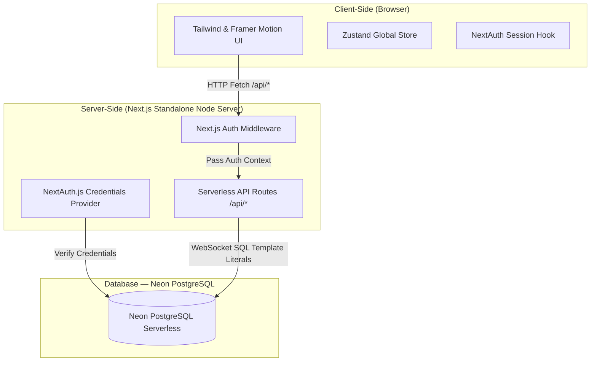
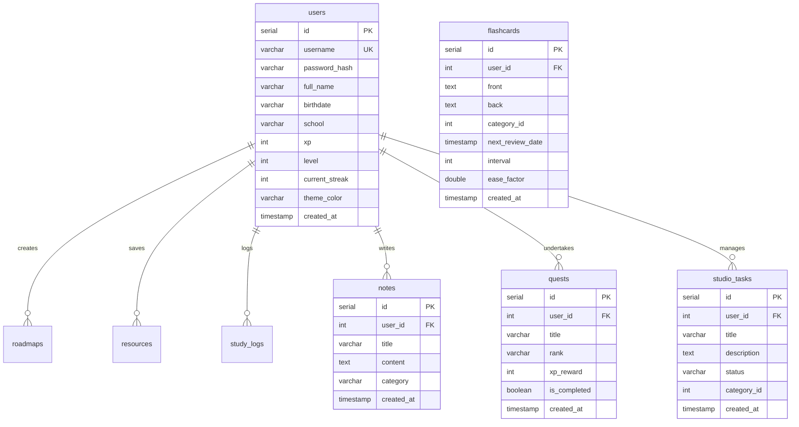

# Learn Tracker — Product Specification

> **Version:** 2.0  
> **Last Updated:** May 27, 2026  
> **Status:** In Development (Advanced MVP - Next.js Standalone Migration)

---

## 1. Overview

**Learn Tracker** is a personal learning management application that helps self-directed learners organize, track, and gamify their learning journey. It combines structured roadmaps, study session logging, resource bookmarking, and quick notes into a single, visually immersive dashboard.

### Vision

> _"Turn self-learning into a game you want to keep playing."_

### Target Users

| Persona                    | Description                                                 |
| -------------------------- | ----------------------------------------------------------- |
| **Self-taught Developers** | Learners following online courses, tutorials, and bootcamps |
| **Career Switchers**       | Professionals reskilling into tech with structured goals    |
| **Students**               | University/college students supplementing formal education  |
| **Lifelong Learners**      | Anyone systematically learning new skills or subjects       |

---

## 2. Tech Stack

| Layer                  | Technology                              | Version               |
| ---------------------- | --------------------------------------- | --------------------- |
| **Frontend Framework** | Next.js (App Router - Standalone Mode)  | 16.1.6                |
| **UI Library**         | React                                   | 19.2.3                |
| **Styling**            | Tailwind CSS                            | v4                    |
| **Animations**         | Framer Motion                           | 12.34.2               |
| **Icons**              | Lucide React                            | 0.575.0               |
| **Backend Framework**  | Next.js Serverless Route Handlers       | 16.1.6                |
| **Database Client**    | `@neondatabase/serverless` (Neon SQL)   | 1.1.0                 |
| **Database**           | Neon Serverless PostgreSQL              | —                     |
| **Auth**               | Auth.js v5 (NextAuth) + Bcrypt Hashing  | Credentials Flow      |

---

## 3. Architecture



### Design System

- **Theme:** Dark mode with glassmorphism aesthetic
- **Base Component:** `GlassCard` — translucent cards with backdrop blur, subtle borders, and hover elevation
- **Layout:** Responsive Bento Grid (1-col mobile → 4-col desktop)
- **Animations:** Staggered entry with Framer Motion (`opacity + translateY`)

---

## 4. Data Model



---

## 5. Features

### 5.1 Bento Grid Dashboard

The main interface uses a **Bento-style grid layout** that arranges widgets in a visually dynamic, card-based grid. Each widget is wrapped in a `GlassCard` with glassmorphism styling.

| Widget          | Grid Span       | Purpose                                   |
| --------------- | --------------- | ----------------------------------------- |
| **Streak**      | 1 col × 2 rows  | Shows current streak, XP bar, and level   |
| **Roadmap**     | 2 cols × 2 rows | Active learning path with step completion |
| **Recent Log**  | 1 col × 1 row   | Last study session with resume action     |
| **Add Widget**  | 1 col × 1 row   | Placeholder for extensibility             |
| **Quick Notes** | 4 cols × 1 row  | Full-width markdown note-taking area      |

---

### 5.2 Streak & Gamification

Tracks learning consistency and rewards progress with XP and levels.

| Field               | Description                                                         |
| ------------------- | ------------------------------------------------------------------- |
| `current_streak`    | Consecutive days of logged study activity                           |
| `xp`                | Experience points earned from completing steps and logging sessions |
| `level`             | Derived from XP thresholds (displayed as badge)                     |
| **XP Progress Bar** | Animated bar showing progress to next level                         |

**Rules:**

- Earn 1 XP per 1 minute of completed study time. Sessions must be at least 5 minutes long to yield XP.
- +25 XP per roadmap step completed
- +50 XP bonus for 7-day streak milestone
- Streak resets if no activity for 24 hours

---

### 5.3 Learning Roadmaps

Structured learning paths with ordered steps.

**Capabilities:**

- Display active roadmap with step list
- Visual distinction between completed and pending steps
- Progress percentage tracking
- Create, edit, and delete roadmaps
- Mark steps as completed (toggle)
- Auto-calculate progress based on completed steps

---

### 5.4 Study Log & Timer

Tracks study sessions with duration and topic.

**Capabilities:**

- Built-in study timer (start/pause/stop) with Pomodoro capabilities.
- Live duration and XP yield calculations.
- Context-aware feeding trigger for the virtual pet companion.

---

### 5.5 Quick Notes

Lightweight note-taking with markdown support.

**Capabilities:**

- Full-width textarea with markdown support.
- Custom saved notes grid.
- Clean XSS prevention logic.

---

### 5.6 Resource Library

Bookmark and categorize learning resources.

**Capabilities:**

- Add/edit/delete resources
- Categorize by type (article, video, course, book)
- Quick-access resource cards on dashboard

---

### 5.7 Virtual Familiar

A gamified virtual pet companion that motivates consistent learning habits.

**Mechanics:**

- **HP Restoration (Feeding):** Users restore HP by completing quests or finishing study sessions.
- **Stat Tracking:** Level, current HP, max HP, and last fed timestamp are persisted in Neon PostgreSQL.
- **Context-aware Feeding:** Quests and study sessions automatically trigger familiar feeding in the frontend store.

---

## 6. API Endpoints

### Standardized API Response Format

All backend API responses are standardized into a JSON envelope wrapper to ease frontend state management and error parsing:

**Success Response:**

```json
{
  "status": "success",
  "data": { ... } // or [...]
}
```

**Error Response:**

```json
{
  "status": "error",
  "code": "DB_ERROR",
  "message": "Human readable error string"
}
```

### Route Table (Next.js Serverless Routes)

All paths are relative to the deployment root:

| Method   | Endpoint                      | Description                                    | Auth Required |
| -------- | ----------------------------- | ---------------------------------------------- | ------------- |
| `POST`   | `/api/auth/signup`            | User registration with Bcrypt encryption        | No            |
| `GET`    | `/api/notes`                  | Get paginated notes list                       | Yes           |
| `POST`   | `/api/notes`                  | Create a new note                              | Yes           |
| `DELETE` | `/api/notes/[id]`             | Delete a specific note                         | Yes           |
| `GET`    | `/api/flashcards`             | List active spaced-repetition cards            | Yes           |
| `POST`   | `/api/flashcards`             | Add flashcard to SRS deck                      | Yes           |
| `PUT`    | `/api/flashcards/[id]/review` | Submit quality grade to SM-2 SRS Algorithm     | Yes           |
| `GET`    | `/api/quests`                 | List active daily quests                       | Yes           |
| `PUT`    | `/api/quests/[id]/complete`   | Log quest completion and trigger XP allocation | Yes           |
| `GET`    | `/api/studio`                 | Get all Kanban board items                    | Yes           |
| `POST`   | `/api/studio`                 | Add a new Creator Pipeline task                | Yes           |
| `PUT`    | `/api/studio/[id]`            | Move pipeline task column status               | Yes           |
| `GET`    | `/api/familiar`               | Fetch pet HP, level, and feed timestamps       | Yes           |
| `PUT`    | `/api/familiar/feed`          | Restores HP and persists new familiar status   | Yes           |

---

## 7. Project Structure

```
LearnTracker/
└── frontend/
    ├── src/
    │   ├── app/
    │   │   ├── (dashboard)/             # Main protected section
    │   │   │   ├── studio/              # Creator Pipeline Kanban page
    │   │   │   ├── flashcards/          # Spaced repetition list page
    │   │   │   └── quests/              # Tavern RPG Quests page
    │   │   ├── api/                     # 100% Native Next.js serverless route handlers
    │   │   │   ├── auth/                # signup and NextAuth handlers
    │   │   │   ├── familiar/            # Tamagotchi status and feed endpoints
    │   │   │   ├── quests/              # RPG Quests list and complete handlers
    │   │   │   └── studio/              # Kanban board and task columns handlers
    │   │   ├── login/                   # Elegant custom login page
    │   │   └── globals.css              # Custom visual layout layer
    │   ├── components/                  # Premium UI components
    │   │   ├── studio/                  # Kanban KanbanColumn and AddTaskModal
    │   │   └── ui/                      # Shared premium GlassCard
    │   ├── lib/
    │   │   ├── api.ts                   # Relative path API fetch wrapper
    │   │   ├── api-helpers.ts           # Standardized ok/err wrappers & session checks
    │   │   └── db.ts                    # Neon PostgreSQL client initialization
    │   └── store/
    │       └── useDashboardStore.ts     # Frontend Zustand global store
    └── package.json
```

---

## 8. Development Roadmap

### Phase 1 — Foundation ✅
- [x] Project scaffolding (Next.js Standalone Monorepo)
- [x] Database schema design in Neon
- [x] Bento Grid dashboard layout
- [x] GlassCard design system component
- [x] All 5 main dashboard widgets (Streak, Roadmap, Timer, Daily Goals, Quick Note)

### Phase 2 — Core Functionality ✅
- [x] Connect to Neon Serverless PostgreSQL with WebSocket template literals
- [x] Standardized API JSON response wrappers
- [x] Full CRUD Next.js Route Handlers (Notes, Flashcards, Quests, Kanban, etc.)
- [x] Wire frontend store to real relative API paths (solving localhost fallback)

### Phase 3 — Gamification & RPG Mechanics ✅
- [x] XP calculation engine and level-up thresholds logic
- [x] Spaced Repetition (SM-2) algorithm for active flashcard review
- [x] Daily Quest generation (weighted rank acak)
- [x] Virtual Familiar (HP/Level/Feeding) state persistence

### Phase 4 — Authentication & Multi-User Flow ✅
- [x] NextAuth.js v5 integration with serverless Credentials Provider
- [x] Password hashing using Bcrypt
- [x] Secure session cookie tracking
- [x] Multi-user data isolation across all database queries

### Phase 5 — Refinements & AI 🔲
- [ ] AI-assisted note summarization
- [ ] AI roadmap suggestions
- [ ] Mobile-first layout optimizations
- [ ] PWA support for offline access

---

## 9. Non-Functional Requirements

| Requirement           | Target                                     |
| --------------------- | ------------------------------------------ |
| **Performance**       | Dashboard loads in < 1.5s on Vercel        |
| **Responsiveness**    | Fully functional on mobile (375px+)        |
| **API Response Time** | < 150ms for all Neon serverless endpoints  |
| **Data Integrity**    | Strict parameterized template sql queries |

---

## 10. Open Questions

1. **AI Provider** — Which LLM provider for "AI Assist" feature (Google Gemini is highly recommended for direct token integration)?
2. **Notification System** — Should we add push notifications for daily quest reminders or pet status alerts?
