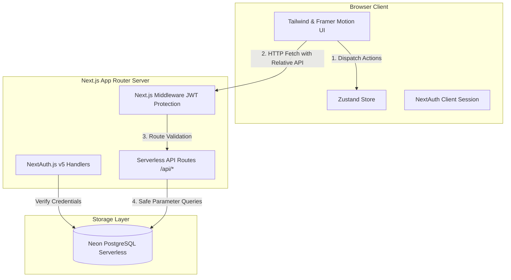
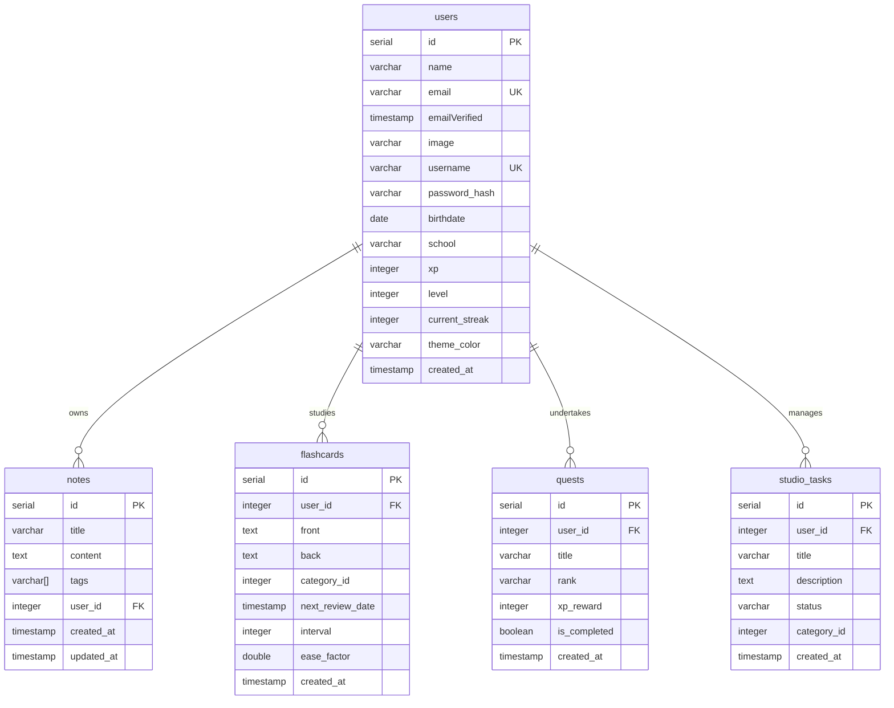
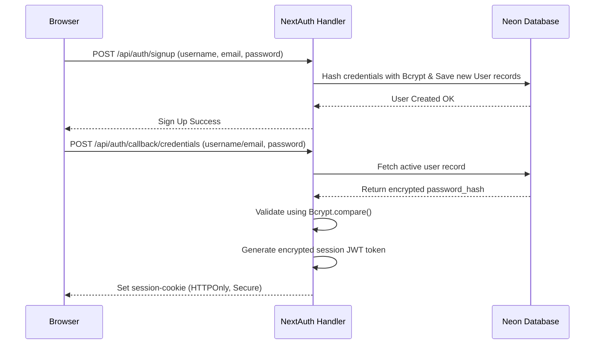

# 📐 Sinau.id - System Architecture & Design Document

This document explains the system architecture, database design, client-side state management, and security structures of the **Sinau.id** platform. The application is built using a unified, high-performance **Full-Stack Next.js Standalone** architecture connected directly to serverless PostgreSQL.

---

## 🏗️ 1. High-Level Architecture

The system utilizes a modern, serverless monolithic architecture powered by **Next.js App Router** deployed on serverless environments (Vercel) and connected to a serverless database instance (Neon DB).



### Architectural Decisions & Rationale:

- **Unified Next.js API Routes:** Eliminates cold-start latencies and extra deployment overheads that occur with a separated Go/Node backend. It keeps client-server bindings extremely simple, simplifies standard deployments, and ensures robust credentials checking via NextAuth.
- **Relative API Calls (`/api`):** All client data fetching is routed relatively against the active host domain. No manual API endpoint configurations are needed when changing environments (development, staging, or production).
- **Neon Serverless PostgreSQL:** A fast, cloud-based PostgreSQL instance utilizing WebSocket templates powered by the `@neondatabase/serverless` driver for near-instant SQL execution.

---

## 🗄️ 2. Database Schema Design

The database schema is mapped inside Neon PostgreSQL. Custom tables are designed to handle study tracking, SRS reviews, RPG task pipelines, daily rewards, and virtual motivation companion states.



### Table Definitions & Implementations:

#### A. Users Table (Core Profile & RPG Motivation Stats)
This table acts as the unified user database containing security credentials alongside active gamification state records:
```sql
CREATE TABLE IF NOT EXISTS users (
    id SERIAL PRIMARY KEY,
    name VARCHAR(255),
    email VARCHAR(255) UNIQUE NOT NULL,
    "emailVerified" TIMESTAMPTZ,
    image TEXT,
    username VARCHAR(255) UNIQUE,
    password_hash VARCHAR(255),
    birthdate DATE,
    school VARCHAR(255),
    xp INTEGER NOT NULL DEFAULT 0,
    level INTEGER NOT NULL DEFAULT 1,
    current_streak INTEGER NOT NULL DEFAULT 0,
    theme_color VARCHAR(50) DEFAULT '#6366f1'
);
```

#### B. Notes Table (with Tag Arrays & Search Support)
Notes table utilizes native PostgreSQL text arrays (`TEXT[]`) and GIN indices for highly efficient tags filtration and full-text searches:
```sql
CREATE TABLE IF NOT EXISTS notes (
    id SERIAL PRIMARY KEY,
    title VARCHAR(255) NOT NULL,
    content TEXT NOT NULL DEFAULT '',
    tags TEXT[] NOT NULL DEFAULT '{}',
    user_id INTEGER NOT NULL REFERENCES users(id) ON DELETE CASCADE,
    created_at TIMESTAMPTZ NOT NULL DEFAULT NOW(),
    updated_at TIMESTAMPTZ NOT NULL DEFAULT NOW()
);

-- Fast array indexation
CREATE INDEX IF NOT EXISTS idx_notes_tags ON notes USING GIN (tags);

-- Fast English search dictionary vectorization
CREATE INDEX IF NOT EXISTS idx_notes_title_content ON notes USING GIN (
    to_tsvector('english', title || ' ' || content)
);
```

#### C. Level Configs Lookup Table
Standard lookup configurations holding strict XP thresholds per level, referencing badges from Novice to Transcendent:
```sql
CREATE TABLE IF NOT EXISTS level_configs (
    level INTEGER PRIMARY KEY,
    min_xp INTEGER NOT NULL,
    max_xp INTEGER NOT NULL,
    title_badge VARCHAR(100) NOT NULL DEFAULT ''
);
```

#### D. Studio Tasks Table (Creator Studio Kanban Board)
Stores Kanban tasks categorized by standard column indicators (`TODO`, `IN_PROGRESS`, `REVIEW`, `DONE`):
```sql
CREATE TABLE IF NOT EXISTS studio_tasks (
    id SERIAL PRIMARY KEY,
    user_id INTEGER REFERENCES users(id) ON DELETE CASCADE,
    title VARCHAR(255) NOT NULL,
    description TEXT,
    status VARCHAR(50) DEFAULT 'TODO',
    category_id INTEGER,
    created_at TIMESTAMP DEFAULT CURRENT_TIMESTAMP
);
```

#### E. Flashcards Table (SM-2 Spaced Repetition Parameters)
Keeps spaced repetition scheduling records referencing memory decay attributes:
```sql
CREATE TABLE IF NOT EXISTS flashcards (
    id SERIAL PRIMARY KEY,
    user_id INTEGER REFERENCES users(id) ON DELETE CASCADE,
    front TEXT NOT NULL,
    back TEXT NOT NULL,
    category_id INTEGER,
    next_review_date TIMESTAMP DEFAULT CURRENT_TIMESTAMP,
    interval INTEGER DEFAULT 0,
    ease_factor DOUBLE PRECISION DEFAULT 2.5,
    created_at TIMESTAMP DEFAULT CURRENT_TIMESTAMP
);
```

---

## 🔐 3. Authentication & Security Design

Authentication is managed via **NextAuth.js v5 (Auth.js)** implementing custom Credentials Flow configurations and encrypted JSON Web Tokens (JWT).



### Security Measures:

1. **HTTPOnly Session Cookies:** Prevents client-side scripts from reading active credentials tokens, neutralizing standard XSS token theft vectors.
2. **Server-Side Session Verification Helper (`getAuthUserId`):**
   Endpoints are secured with a server helper that checks active session tokens inside route threads:
   ```typescript
   export async function getAuthUserId() {
     const session = await auth();
     if (!session?.user?.id) {
       return { error: NextResponse.json({ status: "error", message: "Unauthorized" }, { status: 401 }) };
     }
     return { userId: parseInt(session.user.id, 10) };
   }
   ```

---

## 🎨 4. Frontend Design System & Client State

The UI is built upon the **Matte Dark SaaS** design aesthetic:

- **Base Components:** Container blocks are powered by `MatteCard`, characterized by uniform soft elements: solid matte background (`bg-[#1C1C1E]`), razor-thin border shadows (`border border-white/5`), subtle dark drop shadow elements (`shadow-md shadow-black/20`), and generous rounded corners (`rounded-2xl`).
- **Accent Theme Variables:** Configured inside `@theme` in `globals.css` targeting premium focus colors: clean primary whites (`#f4f4f5`), deep backgrounds (`#121212`), emerald accents for level up/healthy companion HP, amber for streaks, and bright cyan/rose indicators for RPG task difficulty levels.
- **Client State System:** Powered by a persistent **Zustand** store framework that coordinates local caching alongside background relative asynchronous API calls (`api.ts`).
