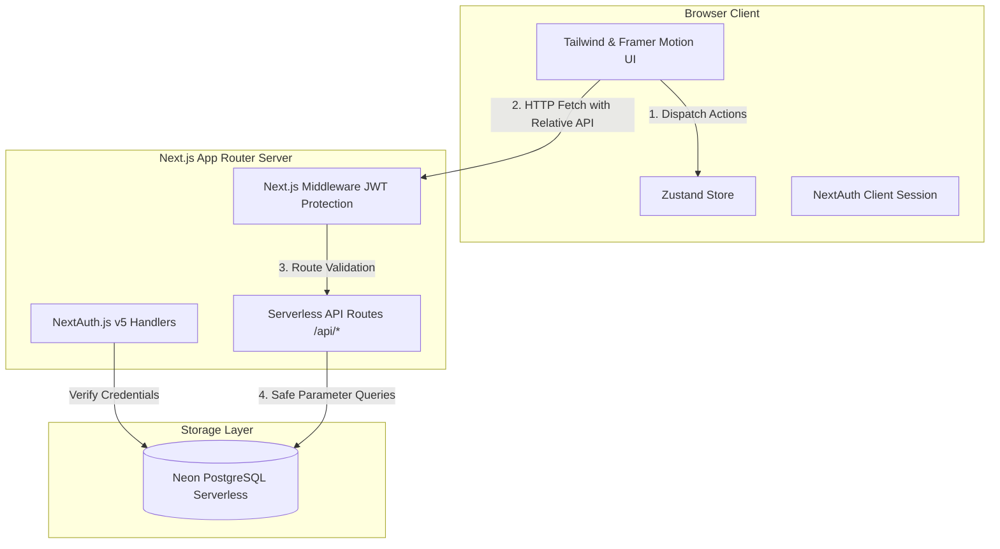
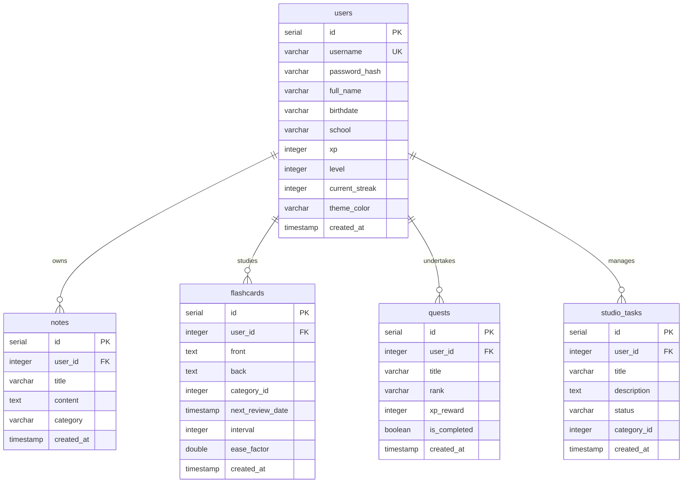
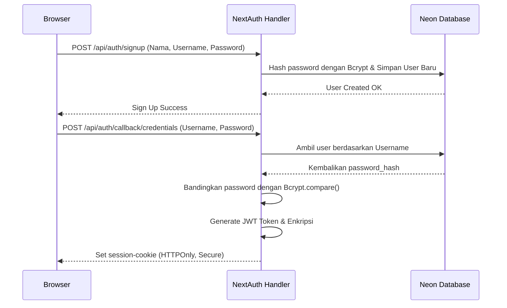

# 📐 Learn Tracker - System Architecture & Design Document

Dokumen ini menjelaskan arsitektur sistem, desain database, sistem state manajemen, dan alur autentikasi dari proyek **Learn Tracker** setelah berhasil dimigrasikan sepenuhnya dari arsitektur backend Go terpisah ke dalam arsitektur **Full-Stack Next.js Standalone**.

---

## 🏗️ 1. High-Level Architecture

Sistem Learn Tracker menggunakan arsitektur modern full-stack monolitik berbasis **Next.js App Router** yang di-deploy di cloud serverless (Vercel) dan terhubung langsung ke serverless PostgreSQL (Neon DB).



### Key Decisions & Rationale:
* **Go to Next.js API Routes Migration:** Mengurangi latensi *cold-start* koneksi antar server, meniadakan biaya deployment backend tambahan (seperti Render gratisan yang sering tertidur), mempermudah pemeliharaan dalam satu repositori tunggal (Monorepo), dan mengoptimalkan integrasi NextAuth.js.
* **Relative API Base URL (`/api`):** Semua request client kini bersifat relatif terhadap domain host. Tidak memerlukan konfigurasi manual `NEXT_PUBLIC_API_URL` baik saat development di localhost maupun production di Vercel.
* **Neon PostgreSQL Serverless:** Database PostgreSQL awan yang mendukung konektivitas serverless super cepat berbasis WebSocket lewat driver `@neondatabase/serverless`.

---

## 🗄️ 2. Database Schema Design

Database tersimpan di Neon PostgreSQL dengan relasi tabel sebagai berikut. RPG gamification diintegrasikan secara terpadu di dalam tabel pengguna utama.



### Detail Skema Tabel Utama:

#### A. Users Table (dengan RPG Stats Terintegrasi)
Tabel ini menyimpan profil pengguna sekaligus status gamifikasi (Tamagotchi / RPG system):
```sql
CREATE TABLE users (
    id SERIAL PRIMARY KEY,
    username VARCHAR(100) UNIQUE NOT NULL,
    password_hash VARCHAR(255) NOT NULL,
    full_name VARCHAR(100) NOT NULL,
    birthdate VARCHAR(50),
    school VARCHAR(100),
    xp INTEGER DEFAULT 0,
    level INTEGER DEFAULT 1,
    current_streak INTEGER DEFAULT 0,
    theme_color VARCHAR(50) DEFAULT '#10B981',
    created_at TIMESTAMP DEFAULT CURRENT_TIMESTAMP
);
```

#### B. Studio Tasks Table (Kanban Board)
Menyimpan tugas pipeline kreator dengan penyesuaian status huruf kapital (`TODO`, `IN_PROGRESS`, `REVIEW`, `DONE`):
```sql
CREATE TABLE studio_tasks (
    id SERIAL PRIMARY KEY,
    user_id INTEGER REFERENCES users(id) ON DELETE CASCADE,
    title VARCHAR(255) NOT NULL,
    description TEXT,
    status VARCHAR(50) DEFAULT 'TODO',
    category_id INTEGER,
    created_at TIMESTAMP DEFAULT CURRENT_TIMESTAMP
);
```

#### C. Flashcards Table (SRS Spaced Repetition)
Menggunakan algoritma pengulangan SM-2 (SuperMemo-2) dengan interval hari dan *Ease Factor*:
```sql
CREATE TABLE flashcards (
    id SERIAL PRIMARY KEY,
    user_id INTEGER REFERENCES users(id) ON DELETE CASCADE,
    front TEXT NOT NULL,
    back TEXT NOT NULL,
    category_id INTEGER,
    next_review_date TIMESTAMP DEFAULT CURRENT_TIMESTAMP,
    interval INTEGER DEFAULT 0,
    ease_factor DOUBLE PRECISION DEFAULT 2.5,
    created_at TIMESTAMP DEFAULT CURRENT_TIMESTAMP
);
```

---

## 🔐 3. Authentication & Security Design

Autentikasi diimplementasikan menggunakan **NextAuth.js v5 (Auth.js)** dengan strategi JWT (*JSON Web Tokens*).



### Keamanan Tambahan:
1. **HTTPOnly Cookies:** Token autentikasi disimpan di dalam cookie berproteksi `HTTPOnly`, mencegah pencurian token via serangan XSS (Cross-Site Scripting).
2. **Serverless Session Verification Helper (`getAuthUserId`):**
   Setiap endpoint serverless dilindungi oleh fungsi pembantu untuk memvalidasi token sesi secara internal langsung dari server:
   ```typescript
   export async function getAuthUserId() {
     const session = await auth();
     if (!session?.user?.id) {
       return { error: NextResponse.json({ status: "error", message: "Unauthorized" }, { status: 401 }) };
     }
     return { userId: parseInt(session.user.id, 10) };
   }
   ```

---

## 🎨 4. Frontend Design System & Client State

Antarmuka dibangun dengan estetika **Premium Dark Gamified Dashboard UI**:
* **UI Framework:** Tailwind CSS dengan kustomisasi font Google Fonts Outfit & Inter.
* **Animasi:** Framer Motion untuk transisi halus antar-halaman, modal, dan micro-interactions pada tombol gamifikasi.
* **Kanban Drag & Drop:** `@dnd-kit/core` & `@dnd-kit/sortable` untuk fungsionalitas drag-and-drop antar kolom yang sangat mulus dengan sistem state bayangan lokal sebelum di-commit secara pesimis ke database.
* **State Management:** **Zustand** dengan integrasi middleware `persist` untuk penyimpanan lokal sementara dan pembaruan data real-time asinkron ke server.

---

## ⚙️ 5. API Response Standardization

Semua Serverless Route Handlers di Next.js mengembalikan struktur respons seragam untuk memudahkan *client-side unwrapping* di frontend:

* **Format Sukses:**
  ```json
  {
    "status": "success",
    "data": { ... }
  }
  ```
* **Format Gagal:**
  ```json
  {
    "status": "error",
    "code": "ERROR_CODE",
    "message": "Detail pesan error untuk user"
  }
  ```

Pola ini secara otomatis didukung oleh parser client `api.ts` yang secara dinamis mendeteksi kunci `status: "success"` atau `success: true` untuk membuka bungkus data (`json.data`) sebelum diteruskan ke Zustand store.
