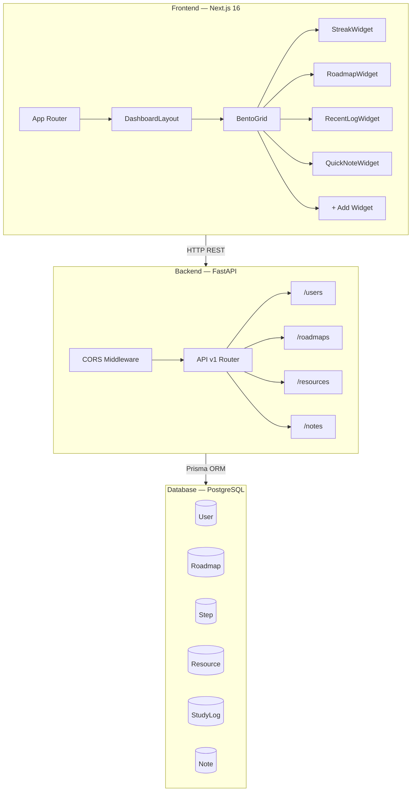
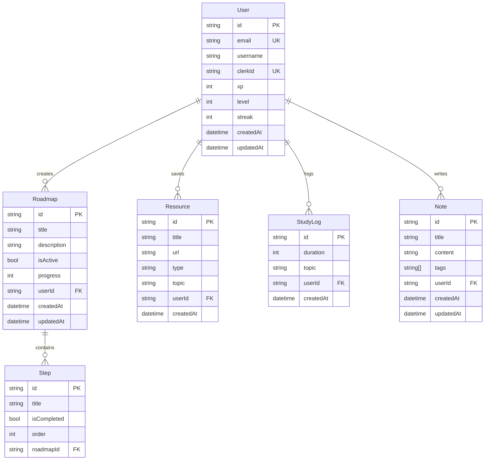

# Learn Tracker — Product Specification

> **Version:** 1.0  
> **Last Updated:** February 19, 2026  
> **Status:** In Development (MVP)

---

## 1. Overview

**Learn Tracker** is a personal learning management application that helps self-directed learners organize, track, and gamify their learning journey. It combines structured roadmaps, study session logging, resource bookmarking, and quick notes into a single, visually immersive dashboard.

### Vision

> *"Turn self-learning into a game you want to keep playing."*

### Target Users

| Persona | Description |
|---|---|
| **Self-taught Developers** | Learners following online courses, tutorials, and bootcamps |
| **Career Switchers** | Professionals reskilling into tech with structured goals |
| **Students** | University/college students supplementing formal education |
| **Lifelong Learners** | Anyone systematically learning new skills or subjects |

---

## 2. Tech Stack

| Layer | Technology | Version |
|---|---|---|
| **Frontend Framework** | Next.js (App Router) | 16.1.6 |
| **UI Library** | React | 19.2.3 |
| **Styling** | Tailwind CSS | v4 |
| **Animations** | Framer Motion | 12.34.2 |
| **Icons** | Lucide React | 0.575.0 |
| **Backend Framework** | FastAPI (Python) | latest |
| **ORM** | Prisma Client Python (async) | latest |
| **Database** | PostgreSQL | — |
| **Auth (planned)** | Clerk | — |

---

## 3. Architecture



### Design System

- **Theme:** Dark mode with glassmorphism aesthetic
- **Base Component:** `GlassCard` — translucent cards with backdrop blur, subtle borders, and hover elevation
- **Layout:** Responsive Bento Grid (1-col mobile → 4-col desktop)
- **Animations:** Staggered entry with Framer Motion (`opacity + translateY`)

---

## 4. Data Model



---

## 5. Features

### 5.1 Bento Grid Dashboard

The main interface uses a **Bento-style grid layout** that arranges widgets in a visually dynamic, card-based grid. Each widget is wrapped in a `GlassCard` with glassmorphism styling.

| Widget | Grid Span | Purpose |
|---|---|---|
| **Streak** | 1 col × 2 rows | Shows current streak, XP bar, and level |
| **Roadmap** | 2 cols × 2 rows | Active learning path with step completion |
| **Recent Log** | 1 col × 1 row | Last study session with resume action |
| **Add Widget** | 1 col × 1 row | Placeholder for extensibility |
| **Quick Notes** | 4 cols × 1 row | Full-width markdown note-taking area |

---

### 5.2 Streak & Gamification

Tracks learning consistency and rewards progress with XP and levels.

| Field | Description |
|---|---|
| `streak` | Consecutive days of logged study activity |
| `xp` | Experience points earned from completing steps and logging sessions |
| `level` | Derived from XP thresholds (displayed as badge) |
| **XP Progress Bar** | Animated bar showing progress to next level |

**Planned Rules:**
- +10 XP per study session logged
- +25 XP per roadmap step completed
- +50 XP bonus for 7-day streak milestone
- Streak resets if no activity for 24 hours

---

### 5.3 Learning Roadmaps

Structured learning paths with ordered steps.

**Current capabilities:**
- Display active roadmap with step list
- Visual distinction between completed and pending steps
- Hover-to-reveal "Start" action on incomplete steps
- Progress percentage tracking

**Planned capabilities:**
- Create, edit, and delete roadmaps
- Mark steps as completed (toggle)
- Auto-calculate progress based on completed steps
- Multiple roadmaps with active selection

---

### 5.4 Study Log & Timer

Tracks study sessions with duration and topic.

**Current capabilities:**
- Display last session topic, duration, and category
- "Resume Session" action button

**Planned capabilities:**
- Built-in study timer (start/pause/stop)
- Session history view with daily/weekly/monthly stats
- Time-per-topic analytics
- Chart visualizations (bar/line charts)

---

### 5.5 Quick Notes

Lightweight note-taking with markdown support.

**Current capabilities:**
- Full-width textarea with markdown hint
- "AI Assist" button (UI placeholder)

**Planned capabilities:**
- Save notes to database with title and tags
- Markdown rendering preview
- Tag-based filtering and search
- AI-powered summarization and suggestions

---

### 5.6 Resource Library

Bookmark and categorize learning resources.

**Current capabilities:**
- Database model defined (title, url, type, topic)
- Skeleton API endpoint

**Planned capabilities:**
- Add/edit/delete resources
- Categorize by type (article, video, course, book)
- Tag by topic
- Quick-access resource cards on dashboard

---

## 6. API Endpoints

### Current (Skeleton)

| Method | Endpoint | Description | Status |
|---|---|---|---|
| `GET` | `/` | Health check | ✅ Implemented |
| `GET` | `/api/v1/users` | List users | 🔲 Stub |
| `GET` | `/api/v1/roadmaps` | List roadmaps | 🔲 Stub |
| `GET` | `/api/v1/resources` | List resources | 🔲 Stub |
| `GET` | `/api/v1/notes` | List notes | 🔲 Stub |

### Planned Full API

| Method | Endpoint | Description |
|---|---|---|
| `POST` | `/api/v1/users` | Create user |
| `GET` | `/api/v1/users/{id}` | Get user profile |
| `PUT` | `/api/v1/users/{id}` | Update user profile |
| `POST` | `/api/v1/roadmaps` | Create roadmap |
| `GET` | `/api/v1/roadmaps/{id}` | Get roadmap with steps |
| `PUT` | `/api/v1/roadmaps/{id}` | Update roadmap |
| `DELETE` | `/api/v1/roadmaps/{id}` | Delete roadmap |
| `PUT` | `/api/v1/roadmaps/{id}/steps/{stepId}` | Toggle step completion |
| `POST` | `/api/v1/study-logs` | Log a study session |
| `GET` | `/api/v1/study-logs` | Get study history |
| `GET` | `/api/v1/study-logs/stats` | Get aggregated stats |
| `POST` | `/api/v1/notes` | Create note |
| `GET` | `/api/v1/notes/{id}` | Get note |
| `PUT` | `/api/v1/notes/{id}` | Update note |
| `DELETE` | `/api/v1/notes/{id}` | Delete note |
| `POST` | `/api/v1/resources` | Add resource |
| `GET` | `/api/v1/resources` | List resources (filterable) |
| `DELETE` | `/api/v1/resources/{id}` | Delete resource |

---

## 7. Project Structure

```
LearnTracker/
├── backend/
│   ├── app/
│   │   ├── api/v1/
│   │   │   ├── api.py              # Router aggregator
│   │   │   └── endpoints/
│   │   │       ├── users.py         # User endpoints
│   │   │       ├── roadmaps.py      # Roadmap endpoints
│   │   │       ├── resources.py     # Resource endpoints
│   │   │       └── notes.py         # Note endpoints
│   │   ├── core/
│   │   │   └── config.py           # App settings
│   │   ├── schemas/
│   │   │   └── schemas.py          # Pydantic models
│   │   └── main.py                 # FastAPI entry point
│   ├── prisma/
│   │   └── schema.prisma           # Database schema
│   └── requirements.txt
│
├── frontend/
│   ├── src/
│   │   ├── app/
│   │   │   ├── layout.tsx          # Root layout
│   │   │   ├── page.tsx            # Dashboard page
│   │   │   └── globals.css         # Global styles
│   │   └── components/
│   │       ├── dashboard/
│   │       │   ├── BentoGrid.tsx    # Grid layout
│   │       │   └── widgets/
│   │       │       ├── StreakWidget.tsx
│   │       │       ├── RoadmapWidget.tsx
│   │       │       ├── RecentLogWidget.tsx
│   │       │       └── QuickNoteWidget.tsx
│   │       ├── layout/
│   │       │   └── DashboardLayout.tsx
│   │       └── ui/
│   │           └── GlassCard.tsx    # Shared glass card
│   └── package.json
│
└── README.md
```

---

## 8. Development Roadmap

### Phase 1 — Foundation ✅
- [x] Project scaffolding (Next.js + FastAPI)
- [x] Database schema design (Prisma)
- [x] Pydantic validation schemas
- [x] Bento Grid dashboard layout
- [x] GlassCard design system component
- [x] All 4 dashboard widgets (static UI)
- [x] Skeleton API endpoints
- [x] CORS configuration

### Phase 2 — Core Functionality 🔲
- [ ] Connect Prisma to PostgreSQL + run migrations
- [ ] Implement full CRUD API for all models
- [ ] Wire frontend widgets to real API data
- [ ] Study timer implementation
- [ ] Note CRUD with markdown rendering
- [ ] Roadmap step toggle (mark complete/incomplete)

### Phase 3 — Gamification & Analytics 🔲
- [ ] XP calculation engine
- [ ] Level-up system with thresholds
- [ ] Streak tracking logic (daily reset)
- [ ] Study time analytics (daily/weekly charts)
- [ ] Topic-based study breakdown

### Phase 4 — Authentication & Multi-User 🔲
- [ ] Clerk integration for auth
- [ ] User registration and login flows
- [ ] Per-user data isolation
- [ ] Profile page

### Phase 5 — Polish & AI 🔲
- [ ] AI-assisted note summarization
- [ ] AI roadmap suggestions
- [ ] Widget customization ("Add Widget" functionality)
- [ ] Dark/light theme toggle
- [ ] Mobile-first responsive refinements
- [ ] PWA support for offline access

---

## 9. Non-Functional Requirements

| Requirement | Target |
|---|---|
| **Performance** | Dashboard loads in < 2s on 3G |
| **Responsiveness** | Fully functional on mobile (375px+) |
| **Accessibility** | WCAG 2.1 AA compliance |
| **Browser Support** | Chrome, Firefox, Safari, Edge (latest 2) |
| **API Response Time** | < 200ms for all endpoints |
| **Data Integrity** | All mutations validated via Pydantic |

---

## 10. Open Questions

1. **Auth Strategy** — Confirm Clerk as the auth provider, or evaluate alternatives (NextAuth.js, Supabase Auth)?
2. **AI Provider** — Which LLM provider for "AI Assist" feature (OpenAI, Google Gemini, local model)?
3. **Deployment Target** — Vercel (frontend) + Railway/Render (backend) + Supabase (database)?
4. **Notification System** — Add streak reminders via email or push notifications?
5. **Social Features** — Should users be able to share roadmaps or compete on leaderboards?
