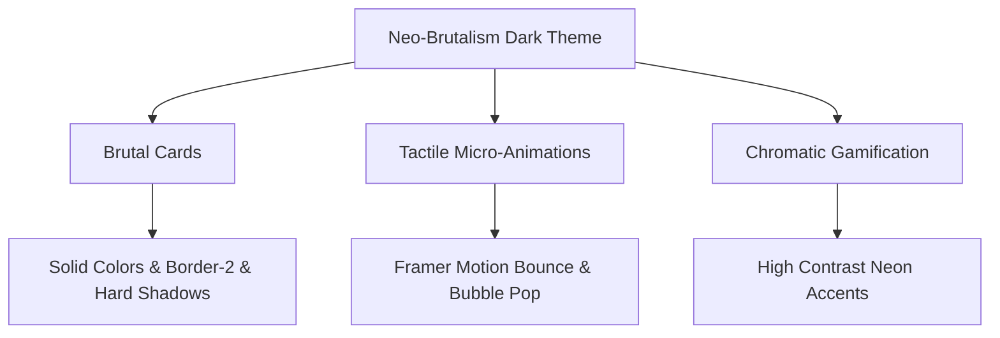

# 🎨 Learn Tracker - UI/UX Design System Specification

Dokumen ini menjelaskan **filosofi desain, pola UX, sistem warna, tipografi, dan arsitektur visual** dari aplikasi **Learn Tracker**. Aplikasi ini mengusung tema **Gamified Productivity System (RPG Style)** dengan pergeseran estetika dari Glassmorphism ke **Neo-Brutalism Dark Mode**.

---

## 🌌 1. Filosofi Desain (Aesthetics & Mood)

Desain UI/UX dari Learn Tracker dibangun menggunakan tema **Neo-Brutalism Dark Mode**. Estetika dirancang dengan kontras sangat tinggi, garis tegas kaku, warna-warna neon mencolok, dan sudut balok yang raw untuk memicu stimulus fokus dan produktivitas tinggi.



### Pilar Utama Estetika:
* **Brutal Card (Gaya Balok):** Menggunakan warna kartu solid gelap gulita (`#191A1B`) dibalut dengan garis pembatas luar tebal 2px (`border-2 border-white/20`) dan efek bayangan offset kaku/blok (`shadow-[4px_4px_0px_0px]`). Tidak ada efek transparansi, opacity, atau blur.
* **Typographic Impact:** Memberikan ruang visual yang besar pada font sans-serif tebal untuk headers dan logo, menjadikannya terkesan kokoh, tegas, dan tidak kenal kompromi.
* **Minimalist Line-Art Assets:** Semua elemen ilustratif (empty state, dekorasi blueprint, maskot) digambar menggunakan format SVG line-art bergaya coretan sketsa kustom berwarna monokrom putih-abu demi estetika *raw/glitch*.
* **Tactile Interactions:** Animasi hover dan tap dikonfigurasi untuk bergerak secara linear atau memantul kaku (spring bounce) demi merepresentasikan tombol konsol retro.

---

## 🎨 2. Palet Warna (Color System)

Sistem warna menggunakan kombinasi solid gelap dengan saturasi neon maksimal untuk memberikan stimulus "dopamine hit" instan.

| Kegunaan Warna | Nama Warna | Kode HEX | Representasi Visual |
| :--- | :--- | :---: | :--- |
| **Latar Belakang Utama** | Pure Solid Dark | `#111111` | Latar belakang dasar aplikasi |
| **Latar Belakang Kartu** | Core Card Gray | `#191A1B` | Kartu solid non-transparan |
| **Aksen Utama / XP** | Neon Green | `#CFFF04` | Progress bar, HP sehat, status aktif |
| **Aksen Streak / Gold** | Dragon Gold | `#F59E0B` | Level up, api streak, tombol aksi primer |
| **Aksen RPG Rank S** | Solar Yellow | `#FCD34D` | Bounty level tersulit |
| **Aksen RPG Rank A** | Glitch Fuchsia | `#F43F5E` | Bounty level tinggi |
| **Aksen RPG Rank B** | Retro Cyan | `#06B6D4` | Bounty level menengah |
| **Aksen RPG Rank C** | Cool Slate | `#64748B` | Bounty level harian |

---

## ✍️ 3. Tipografi & Hierarki Visual

Tipografi dirancang agar kokoh dan kontras tinggi di atas latar belakang gelap.

* **Headings (Judul Halaman & Judul Widget):** Menggunakan font **Outfit** (Sans-serif tebal bulat modern) berkarakter tebal kaku (`font-black`) dan hampir selalu disajikan dalam huruf besar (*uppercase*).
* **Body Text & Input:** Menggunakan font **Inter** (Sans-serif dengan keterbacaan tinggi) untuk menjamin log belajar, deskripsi kartu, dan catatan markdown terbaca dengan nyaman.
* **Hierarki Font:**
  * **H1 (Page Title):** `text-4xl (36px)` \| `font-Outfit` \| `font-bold` \| `uppercase` \| `text-white`
  * **H2 (Card Headers):** `text-xl (20px)` \| `font-Outfit` \| `font-bold` \| `uppercase` \| `text-white`
  * **Body (Regular):** `text-sm (14px)` \| `font-Inter` \| `font-bold` \| `text-slate-300`
  * **Muted (Subtitles):** `text-xs (12px)` \| `font-Outfit` \| `font-bold` \| `text-slate-500`

---

## 🗺️ 4. Layout & Tata Ruang (Space Partitioning)

Tata letak menggunakan partisi grid bento solid tanpa margin melengkung yang berlebihan.

```
+-------------------------------------------------------------+
| [/\] LearnTracker  |  COMMAND CENTER (Header)               |
|                    +----------------------------------------+
| [ ] Dashboard      | [ Daily Progress ]  [ Active Roadmap ] |
| [ ] Creator Studio | [ Streak: 5 Days ]  [ Blueprint SVG  ] |
| [ ] Tavern Quests  |                                        |
| [ ] Flashcards     +----------------------------------------+
| [ ] Settings       | [ Active Bounties ]      [ Focus Timer]|
|                    | [ Rank S: Task    ]      | 25:00 | [>] |
+--------------------+----------------------------------------+
```

### Layout Grid Dinamis (Dashboard Layout Engine)
1. **Sidebar Navigasi Kiri (Persistent):** Panel ramping dengan logo *triangle blueprint* di bagian atas, tombol-tombol navigasi bersiku tajam, dan status profil user "Hacker Plan" di bagian bawah.
2. **Dashboard Widgets:**
   * **Daily Progress Widget:** Menampilkan bar XP datar bersudut tajam berwarna Neon Green, jumlah api streak dalam bingkai kuning kaku, dan maskot.
   * **Focus Timer Widget:** Waktu digital kaku berukuran raksasa dengan tombol status bergaya *retro console*.
   * **Tavern Quests (Active Bounties):** Kartu daftar quest horizontal yang diberi penanda warna tebal solid sesuai tingkat Rank kesulitannya.

---

## 🎮 5. UX Karakteristik Fitur Utama

### A. Tavern Quests (RPG Quest List)
* **UX Flow:** Pengguna membuka Tavern Quests -> Quest RNG dengan Rank muncul -> Selesaikan tugas riil -> Klik `"Claim Bounty"` -> Terjadi letusan confetti dan penambahan XP bar secara asinkron.
* **UI Design:** Kartu menggunakan border hitam tebal dengan aksen warna solid di sudutnya untuk menandakan Rank (kuning untuk S, fuchsia untuk A, cyan untuk B, abu-abu untuk C) serta efek melayang statis saat hover.

### B. Creator Studio (Kanban Board)
* **UX Flow:** Transisi drag-and-drop tugas kanban. Saat ditarik, muncul kotak pengganti bergaris putus-putus solid dengan bayangan tegas di posisi peletakan.
* **UI Design:** Kartu status tugas didesain bersiku tajam 90 derajat tanpa lengkungan (*rounded-none*) dengan variasi border neon yang mencolok ketika tugas berstatus aktif.

### C. SRS Flashcards (Sistem Kartu Pintar)
* **UX Flow:** Tap kartu -> Kartu berputar Y 180 derajat secara linear dan tegas -> Tampilkan jawaban beserta tombol umpan balik kualitas memori (Easy, Medium, Hard).
* **UI Design:** Sisi belakang kartu dibingkai border merah/kuning/hijau solid untuk membedakan opsi tingkat hafalan secara visual.

### D. Familiar Pet System (Tamagotchi RPG)
* **UX Flow:** Hewan peliharaan (familiar) berada di dashboard dengan level statis. Saat user produktif, mereka mendapatkan item pakan untuk memulihkan HP-nya.
* **UI Design:** Menggunakan maskot **Minimalist SVG Tech-Blob** berbentuk alien bergaris putih solid lengkap dengan mata piksel kaku, antena neon, serta gelembung chat persegi dengan bayangan tajam yang muncul saat diklik. HP bar digambarkan tebal tanpa radius kelengkungan dengan warna Neon Green atau merah menyala (saat sekarat).
