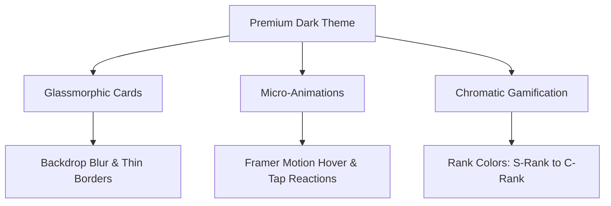

# 🎨 Learn Tracker - UI/UX Design System Specification

Dokumen ini menjelaskan **filosofi desain, pola UX, sistem warna, tipografi, dan arsitektur visual** dari aplikasi **Learn Tracker**. Aplikasi ini mengusung tema **Gamified Productivity System (RPG Style)** yang memadukan unsur petualangan RPG/Tamagotchi ke dalam sistem manajemen pembelajaran harian.

---

## 🌌 1. Filosofi Desain (Aesthetics & Mood)

Desain UI/UX dari Learn Tracker dibangun menggunakan tema **Premium Dark Cyber-Fantasy**. Estetika dirancang untuk memberikan kenyamanan saat belajar di malam hari (mencegah kelelahan mata) sekaligus memicu motivasi pengguna melalui visualisasi yang interaktif dan dramatis.



### Pilar Utama Estetika:
* **Glassmorphism (Efek Kaca):** Menggunakan latar belakang semi-transparan dengan tingkat keburaman tinggi (`backdrop-blur-md`) dan garis pembatas yang sangat tipis (`border-slate-800/50`) untuk menciptakan kesan kedalaman layer 3D yang modern dan premium.
* **Ambient Glow / Backlights:** Penempatan background blob bercahaya ungu (`indigo-500/10`) dan hijau emerald (`primary/10`) dengan tingkat keburaman tinggi (`blur-[100px]`) di sudut-sudut aplikasi untuk nuansa fiksi ilmiah / magis.
* **Micro-Animations:** Setiap interaksi hover (tombol membesar `scale-105`) dan klik (tombol mengecil `scale-95`) dianimasikan menggunakan Framer Motion untuk memberikan feedback visual yang "hidup" (*alive*).

---

## 🎨 2. Palet Warna (Color System)

Sistem warna diatur secara sistematis untuk mewakili status RPG (Rank) serta kenyamanan membaca di latar gelap.

| Kegunaan Warna | Nama Warna | Kode HEX | Representasi Visual |
| :--- | :--- | :---: | :--- |
| **Latar Belakang Utama** | Slate Deep Black | `#020617` | Latar luar gelap pekat |
| **Kartu & Konten (Glass)**| Slate Card Gray | `#0F172A` | Kartu semi-transparan dengan blur |
| **Warna Aksen Utama** | Emerald Green | `#10B981` | Mewakili XP, Level Up, dan Sukses |
| **Aksen RPG Rank S** | Dragon Gold | `#F59E0B` | Misi dengan tingkat kesulitan tertinggi |
| **Aksen RPG Rank A** | Royal Purple | `#8B5CF6` | Misi sulit |
| **Aksen RPG Rank B** | Cyber Blue | `#3B82F6` | Misi sedang |
| **Aksen RPG Rank C** | Silver Slate | `#94A3B8` | Misi santai harian |

---

## ✍️ 3. Tipografi & Hierarki Visual

Tipografi dirancang agar seimbang antara nuansa premium modern dan keterbacaan tingkat tinggi.

* **Headings (Judul Utama & Judul Fitur):** Menggunakan font **Outfit** (Sans-serif bulat modern) dengan berat *Bold* (`font-bold`) untuk memperkuat nuansa futuristik.
* **Body Text (Konten, Teks, & Input):** Menggunakan font **Inter** (Sans-serif netral berskala tinggi) untuk memastikan teks penjelasan, log belajar, dan tulisan flashcard sangat mudah dibaca.
* **Hierarki Font:**
  * **H1 (Page Title):** `text-3xl (30px)` \| `font-bold` \| `text-white`
  * **H2 (Card Headers):** `text-xl (20px)` \| `font-semibold` \| `text-slate-100`
  * **Body (Regular):** `text-sm (14px)` \| `font-normal` \| `text-slate-400`
  * **Muted (Subtitles):** `text-xs (12px)` \| `font-medium` \| `text-slate-500`

---

## 🗺️ 4. Layout & Tata Ruang (Space Partitioning)

Tata letak Learn Tracker menggunakan pembagian ruang yang konsisten, ergonomis, dan sepenuhnya responsif.

```
+-------------------------------------------------------------+
| [L] Learn Tracker  |  DASHBOARD (Header)      [Edit Layout] |
|                    +----------------------------------------+
| (o) Dashboard      | [ Daily Progress ]  [ Active Roadmap ] |
| (x) Creator Studio | [ Streak Counter ]  [ Path Mastered! ] |
| (o) Tavern Quests  |                                        |
| (o) Flashcards     +----------------------------------------+
| (o) Settings       | [ Select Category v ]    [ Focus Timer]|
|                    | [ Active Bounties ]      | 00:00 | [o] |
+--------------------+----------------------------------------+
```

### Layout Grid Dinamis (Dashboard Layout Engine)
Di halaman dashboard utama, pengguna disuguhi grid dinamis yang memisahkan widget fungsional:
1. **Sidebar Navigasi Kiri (Persistent):** Sidebar ramping yang menampung logo bercahaya, menu navigasi ikonik (Dashboard, Studio, Quests, Flashcards, Settings), dan status ringkas akun user di bawah.
2. **Dashboard Widgets:**
   * **Daily Progress Widget:** Menampilkan sisa XP untuk naik level, indikator streak, dan status hewan peliharaan (Tamagotchi Familiar).
   * **Focus Timer Widget:** Timer visual melingkar yang membantu fokus belajar (Pomodoro RPG).
   * **Kanban Pipeline (Creator Studio):** Kolom status horizontal (To Do -> Done) yang ramah untuk mata dari kiri ke kanan.

---

## 🎮 5. UX Karakteristik Fitur Utama

### A. Tavern Quests (RPG Quest List)
* **UX Flow:** Pengguna membuka Tavern Quests -> Melihat daftar quest harian hasil acak RNG dengan Rank (S, A, B, C) -> Menyelesaikan tugas riil di dunia nyata -> Menekan tombol `"Claim Bounty"` -> Terjadi animasi confetti (`canvas-confetti`) di layar yang memuaskan dan peningkatan progress XP bar secara langsung (*instant gratification*).
* **UI Design:** Kartu quest memiliki garis kiri tebal sesuai warna Rank-nya (misal emas untuk S-Rank) untuk membedakan urgensi dan tingkat kebanggaan secara instan.

### B. Creator Studio (Kanban Board)
* **UX Flow:** Menawarkan interaksi drag-and-drop antar status. Saat kartu diangkat, muncul **DragOverlay** semi-transparan yang melayang mengikuti kursor, sementara ruang asli di kolom menjadi kosong dengan garis putus-putus sebagai pemandu lokasi penjatuhan (*drop indicator*).
* **UI Design:** Kolom berlatar belakang abu-abu gelap transparan dengan kontras tinggi untuk menjaga pemisahan fokus visual saat memindahkan tugas.

### C. SRS Flashcards (Sistem Kartu Pintar)
* **UX Flow:** Pengguna menekan kartu -> Terjadi animasi rotasi Y 180 derajat (Flip animation) yang mulus berkat CSS 3D Transforms dan Framer Motion untuk menampilkan jawaban di sisi belakang.
* **UI Design:** Tombol feedback kualitas jawaban di sisi belakang dibedakan dengan warna intuitif untuk memudahkan penekanan cepat tanpa berpikir panjang.

### D. Familiar Pet System (Tamagotchi RPG)
* **UX Flow:** Hewan peliharaan (familiar) memiliki indikator nyawa (HP). Saat pengguna malas belajar, HP hewan peliharaan akan berkurang perlahan. Sebaliknya, saat pengguna menyelesaikan sesi belajar, quest, atau kartu flashcard, mereka mendapatkan item makanan untuk memberi makan hewan peliharaan (`feedFamiliar`), memulihkan HP, dan menaikkan levelnya.
* **UI Design:** Karakter digambarkan secara interaktif dengan indikator HP bar berwarna jingga kemerahan (`orange-500`) dan level emas.
