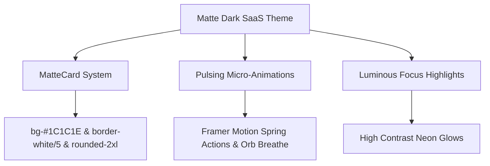

# 🎨 Sinau.id - UI/UX Design System Specification

This document details the **design philosophy, user experience patterns, typographic rules, and color systems** of the **Sinau.id** self-directed learning ecosystem. The interface is built upon the **Matte Dark SaaS** design framework, shifting away from aggressive brutalist edges to premium, sleek, and highly-immersive interfaces designed for hyper-focused workflows.

---

## 🌌 1. Design Philosophy (Aesthetics & Mood)

The design system of **Sinau.id** utilizes a premium **Matte Dark SaaS** aesthetic. The layout balances deep zinc shades, soft rounded container panels, and highly-saturated luminous accent highlights to provide instant dopamine hits while preventing visual fatigue.



### Core Design Foundations:

- **Matte Card Surfaces:** Core content sections are contained in `MatteCard` panels. Cards feature a custom solid matte gray surface (`bg-[#1C1C1E]`), faint luminous borders (`border border-white/5`), subtle drop shadows (`shadow-md shadow-black/20`), and generous rounded corners (`rounded-2xl`). This ensures layout structures look cohesive without requiring visual clutter.
- **Subtle Texture Overlays:** The application canvas background (`#121212`) features an ultra-faint SVG noise texture filter (`opacity: 0.02`) to create a physical "matte canvas" atmosphere, reducing standard screen glare.
- **Typographic Impact:** Strong contrast is achieved by balancing heavy geometric heading typography with clean sans-serif body spacing to deliver optimal content scannability.
- **Ambient Glowing Elements:** Integrated glowing orbs and pulsing signals are used as status guides to emphasize critical gamification checkpoints (like pet health status and timer durations).

---

## 🎨 2. Color System

The palette features a clean zinc-based base contrasted with highly saturated accent tones that illuminate core interactive nodes.

| Accent Category | Tone Name | HEX Code | UX Purpose |
| :--- | :--- | :---: | :--- |
| **Canvas Background** | Pure Zinc Dark | `#121212` | Solid matte primary background |
| **Card Surface** | Core Matte Gray | `#1C1C1E` | Unified surface container |
| **Clean Primary** | White-Zinc | `#f4f4f5` | Default text and primary active buttons |
| **Active Progress / XP**| Luminous Emerald | `#34d399` | Health meters, XP gains, completed indicators |
| **Gamification / Level**| Dragon Amber | `#fbbf24` | Streak fire alerts, levels, milestone gains |
| **RPG Rank S / Focus**  | Solar Yellow | `#fcd34d` | Extreme tasks, active focus indicators |
| **RPG Rank A / Alerts**  | Glitch Rose | `#fb7185` | High difficulty bounties, urgent settings |
| **RPG Rank B / Tech**    | Radiant Cyan | `#22d3ee` | Spaced repetition cards, tags selectors |
| **Muted Accents** | Zinc Gray | `#a1a1aa` | Muted subtitle texts, inactive paths |

---

## ✍️ 3. Typography & Hierarki Visual

Typographic hierarchies are tailored to differentiate system actions from readable learning content.

- **Headings & Badges:** Rendered in **Outfit** (a bold, rounded, modern geometric sans-serif) using strong weights (`font-black`) and clean letter-spacing rules. Primary metrics and badges are styled in uppercase to maintain a solid, premium SaaS dashboard authority.
- **Body & Inputs:** Rendered in **Inter** (recognized for exceptional readability in dark mode interfaces). Inter is applied to learning logs, Markdown note views, and forms to ensure readability.
- **Standard Hierarchy Classes:**
  - **H1 (Page Title):** `text-4xl (36px)` \| `font-Outfit` \| `font-bold` \| `tracking-tight` \| `text-zinc-100`
  - **H2 (Widget Title):** `text-lg (18px)` \| `font-Outfit` \| `font-semibold` \| `text-zinc-200`
  - **Body (Regular):** `text-sm (14px)` \| `font-Inter` \| `font-normal` \| `text-zinc-400`
  - **Muted Details:** `text-xs (12px)` \| `font-Outfit` \| `font-medium` \| `text-zinc-500`

---

## 🗺️ 4. Layout & Navigation Grid

The cockpit workspace distributes sections using a streamlined persistent grid:

```
+-------------------------------------------------------------+
| [S] Sinau.id  |  [Search Everything...]   (O) Familiar Orb  |
|               +---------------------------------------------+
| [x] Dashboard | [ Active Streak ]    [ Learning Roadmap   ] |
| [ ] Studio    | [ Level 5: Expert ]    [ Step Tracker (85%) ] |
| [ ] Quests    |                                             |
| [ ] Skills    +---------------------------------------------+
| [ ] Decks     | [ Daily RPG Tavern ]    [ Focus Pomodoro  ] |
| [ ] Settings  | [ S: Complete Core ]    [ 25:00 - active ]  |
+---------------+---------------------------------------------+
```

### Layout Elements:

1. **Persistent Navigation Sidebar:** Renders clean active route buttons. Ramps down from desktop persistent configurations to mobile navigation drawers via elegant responsive layouts.
2. **Utility Top Navbar:** Integrates a comprehensive workspace search bar, a responsive notification utility, and the **Virtual Familiar Orb**—providing a clean motivating pet status feedback directly inside the primary navigation thread.
3. **Responsive Bento Grid:** Distributes widgets dynamically based on viewport dimensions. Each container uses `MatteCard` interfaces to organize roadmaps, study timers, streak counters, and notes.

---

## 🎮 5. UX Karakteristik Fitur Utama

### A. Tavern Quests RPG Board
- **UX Flow:** Users check active Tavern Quests -> Trigger RNG to roll fresh bounties -> Complete task checks -> Click `Claim Bounty` to earn XP and items. Completed cards trigger confetti and update the persistent XP bar.
- **UI Design:** Cards use thin border colors matching bounty ranks (Rose for A, Yellow for S, Cyan for B). Hover triggers subtle transformations to reinforce interactiveness.

### B. Creator Studio (Kanban Tasks Pipeline)
- **UX Flow:** Smooth drag-and-drop actions built on `@dnd-kit`. Dragging a task displays a dashed drop indicator and updates status columns dynamically.
- **UI Design:** Cards feature clean borders, category highlights, and details. Column separators are rendered with thin borders for a modern look.

### C. Spaced Repetition (SRS) Decks
- **UX Flow:** Click flashcards to trigger Y-axis 180-degree card flips. Once flipped, users select a qualitative memory recall grade (Easy, Medium, Hard) to schedule the next review date via the SM-2 algorithm.
- **UI Design:** Back sides feature subtle indicators (emerald for Easy, amber for Medium, rose for Hard) to assist users during memory reviews.

### D. Virtual Familiar Motivator
- **UX Flow:** The companion is displayed inside dashboard widgets and the top navbar (Familiar Orb). Users restore companion health using items from their inventory or by logging focus hours.
- **UI Design:** The companion is styled as a modern **SVG Tech-Blob** mascot with subtle floating animations, pulsing antennas, and custom chat bubbles. The health bar is rendered as a clean, rounded emerald line indicating active stamina.
